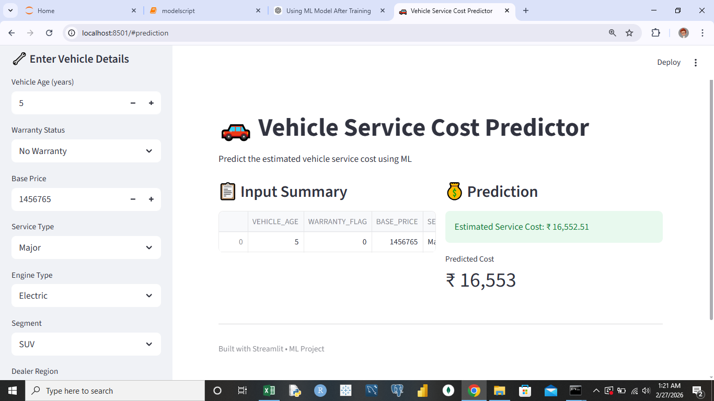

# Hyundai Service Cost Analysis & Prediction

## Executive Summary
This project delivers an end-to-end analytics and machine learning solution to analyze Hyundai vehicle service patterns and predict future service costs.
It demonstrates practical proficiency in data engineering, analytical modeling, business intelligence, and application deployment.
The solution enables stakeholders to monitor service expenditure, understand cost drivers, and make data-informed operational decisions.

## Business Objective
Automotive service operations require visibility into:
Rising maintenance costs
Customer service behavior
Vehicle aging impact on expenses
Forecasting future service costs
This project addresses these needs through an integrated analytics pipeline and predictive model.

## Solution Architecture
### Data Generation → Snowflake → Data Processing → Machine Learning → Tableau Dashboard → Streamlit Application

## Workflow
1.Synthetic automotive data generated using Faker
2.Data stored and managed in Snowflake
3.Data cleaning and feature engineering performed in Pandas
4.Regression model built to predict service cost

## Datasets
The master analytical dataset is constructed by integrating four core tables:
Customers table
Vehicles
Sales
Service

## Key Performance Indicators
The dashboard monitors the following business metrics:
Total Service Cost — SUM(service_cost)
Total Services — COUNT(service_id)
Average Service Cost — AVG(service_cost)
Unique Customers — COUNTD(customer_id)

## Business Intelligence Dashboards
Hyundai Service Overview
Provides high-level operational visibility:
KPI summary
Yearly service cost trend
Service volume analysis
Customer distribution
Hyundai Service Cost Drivers
Identifies factors influencing maintenance expenses:
Vehicle age vs. service cost
Model-wise cost comparison
Engine type impact
High-cost customer segments

## Tableau Public:
Add your published dashboard link here
https://public.tableau.com/app/profile/barath.p8111/viz/HyundaiservicecostOverreview/Dashboard1

## Machine Learning Component
### Objective
Predict vehicle service cost using historical service and vehicle attributes.
### Model Type
Supervised Regression (Scikit-learn)
Input Features
vehicle_age
engine_type
segment
base_price
Service history attributes

### Target Variable
service_cost

### Evaluation Metrics
Mean Absolute Error (MAE)
Root Mean Squared Error (RMSE)
R² Score

## Streamlit Application
An interactive web interface allows users to input vehicle characteristics and obtain predicted service costs in real time.

### Run Locally
streamlit run app.py

## Technology Stack
Python
Pandas
Faker
Snowflake
Scikit-learn
Tableau Public
Streamlit

## Git & GitHub
## Repository Structure
hyundai-service-cost-analysis/
│
├── Datasets/
├── Scripts /
├── sql/
│   └── analysis_queries.sql
├── app.py
├── Dashboard
├── servicecostmodel
└── preproccessor.pkl

## Author
Barath
Data Analyst
Interactive dashboards developed in Tableau Public

Prediction interface deployed via Streamlit
